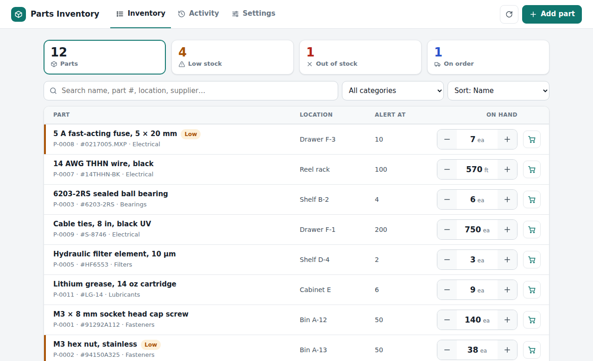
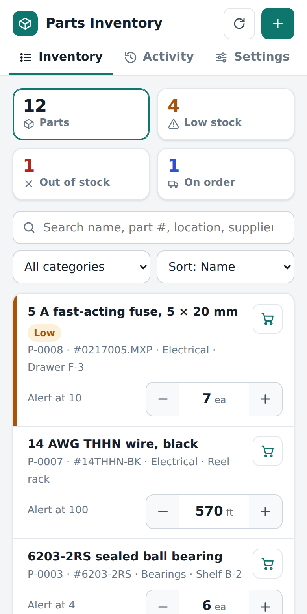
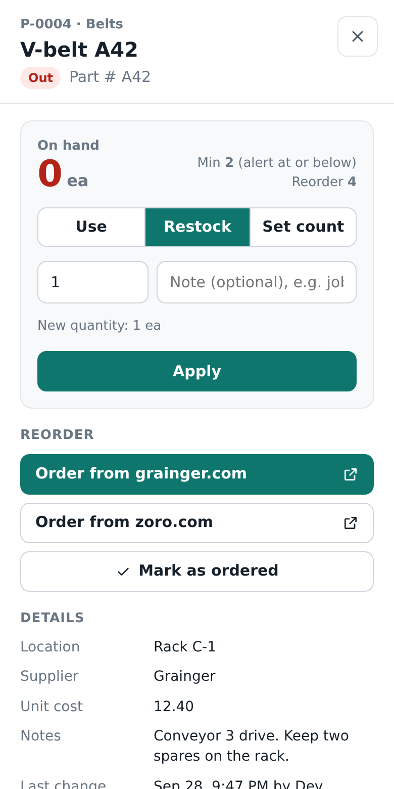
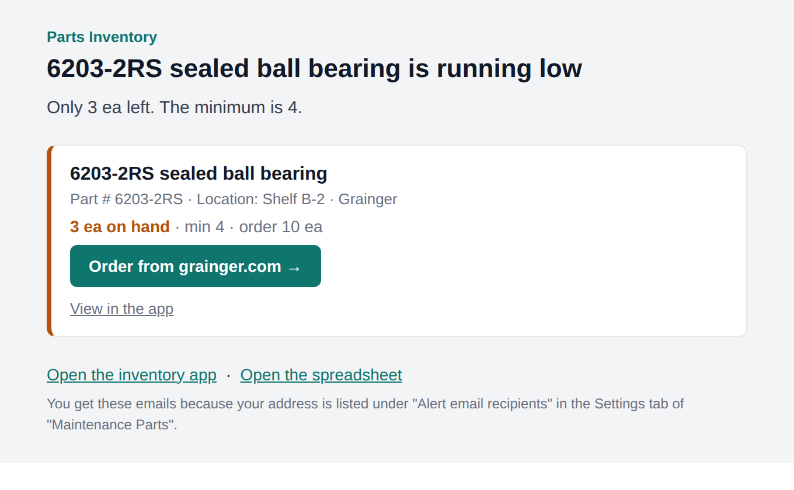

# Parts Inventory

Keep track of your parts in a Google Sheet, update the counts from your phone or computer, and get an
email with the reorder link as soon as something runs low.

<p>
  
</p>
<p>
  
  
</p>

**What it does**

- **Your Google Sheet is the database.** Parts live in an *Inventory* tab you can still open, sort, filter and edit
  like any other spreadsheet. Changes made there show up in the app, and the other way round.
- **An app for the stockroom.** Search, tap − / + as parts are used or restocked, set exact counts, add notes.
  It works on phones, tablets and computers, and also opens as a sidebar inside the spreadsheet.
- **Order links for every part.** Save the page to reorder each part from (McMaster-Carr, Grainger,
  Digi-Key, Amazon, anything with a web address), plus backup suppliers if you like.
- **Automatic low-stock emails.** Give a part a *Min Qty*. When the quantity drops to that number or
  below, an email goes out right away with the order link as a button. Each part is emailed about once, and again
  only after it has been restocked and runs low again.
- **A daily or weekly reminder** of everything that's still low. Parts you've marked *ordered* are listed
  separately so nobody orders twice.
- **An activity log** of who used, restocked or changed what, and which emails went out.



It runs on Google Apps Script, attached to your spreadsheet. There's no server to host and nothing to
pay for. Emails are sent from your Google account to any address, Outlook included.

---

## Set it up (about 10 minutes)

You need a Google account (a free Gmail account works, and so does Google Workspace).

### 1. Make the spreadsheet

Go to [sheets.new](https://sheets.new) to create a new Google Sheet, and give it a name (for example *Parts Inventory*).

> Already have a parts list in Google Sheets? You can use it; see [Use your existing spreadsheet](#use-your-existing-spreadsheet).

### 2. Add the code

1. In the spreadsheet, click **Extensions → Apps Script**. A code editor opens in a new tab with a file called `Code.gs`.
2. Open [`src/Code.js`](src/Code.js) here on GitHub and click the **Copy raw file** button (the two squares at
   the top right of the file).
3. In the Apps Script editor, select everything in `Code.gs`, delete it, and paste.
4. Click the **+** next to *Files*, choose **HTML**, and name it `Index` (exactly that; the editor adds `.html`).
5. Copy [`src/Index.html`](src/Index.html) the same way, select everything in the new `Index.html` file, and paste over it.
6. Click the save icon (💾), or press Ctrl+S / ⌘S.

### 3. Run setup

1. Go back to the spreadsheet tab and **reload the page**. After a few seconds an **Inventory** menu appears next to *Help*.
2. Click **Inventory → Set up / repair**.
3. Google asks you to authorize the script. Click **Continue** and choose your account. When it says
   *"Google hasn't verified this app"*, click **Advanced → Go to (your project name)**, then **Allow**.
   This is normal for a script you added yourself: it only asks to use this spreadsheet, send email as you,
   and run on a schedule.
4. Setup creates three tabs (**Inventory**, **Settings** and **Activity Log**) and turns on the automatic checks.
   Low-stock emails go to your own address to start with. Change that in the **Settings** tab.

You can already add parts right in the Inventory tab, or use **Inventory → Open in sidebar**.

### 4. Put the app on your phone and computer

1. In the Apps Script editor, click the blue **Deploy** button → **New deployment**.
2. Next to *Select type*, click the gear ⚙ and choose **Web app**.
3. Set **Execute as** to **Me**.
4. Set **Who has access** (see [Sharing with coworkers](#sharing-with-coworkers) if unsure):
   - **Only myself**: just you.
   - **Anyone within *your company***: available if you use Google Workspace. Best for teams.
   - **Anyone with a Google account**: coworkers sign in with any Google account.
   - **Anyone**: no sign-in needed. Then also set an **App access code** in the Settings tab.
5. Click **Deploy** (and **Authorize access** if asked), then copy the **Web app URL**.
6. Open that URL. Bookmark it, or on a phone use *Share → Add to Home Screen* so it opens like an app.

The first time the URL is opened, it's saved in the Settings tab so the emails can link back to the app.

### 5. Add your parts

Click **Add part**, or type rows into the Inventory tab. For every part you want emails about, fill in:

- **Min Qty**: the low-stock level. The email goes out when *Quantity* drops to this number or below.
  Leave it blank for parts you don't need alerts for.
- **Order Link**: the web page to reorder from. It becomes the *Order* button in the app and the email.
- **Reorder Qty** (optional): how many to buy. It's shown in the email.

Then check it end to end with **Inventory → Send test email**. If it doesn't arrive within a minute or two,
look in your spam folder and mark it *Not spam*.

---

## How the low-stock emails work

- **Instantly:** when a part drops to or below its *Min Qty* (from the app, from someone editing the
  spreadsheet, or anything else), one email goes to everyone in *Alert email recipients*. Several parts
  going low at the same time share one email.
- **Once per shortage:** the *Alert Sent* column remembers that the part was emailed about. Once the part is
  restocked above its *Min Qty*, the mark is cleared, so the next time it runs low, you get a new email.
- **Reminder:** on the schedule you pick (off, daily, weekdays or weekly), a summary lists every part
  that's still low. Parts marked **ordered** in the app show up under *Already on order* and don't
  trigger a reminder on their own. The *ordered* mark clears itself when the part is restocked.
- **Safety net:** a check runs every hour and catches anything missed, like a failed email (they're
  retried), a formula that changed a quantity, or edits made while the email service was busy.

If lots of parts run low at once, the email shows the first 25 in full and lists the rest by name, so
it stays under Gmail's size limit.

Google limits how many emails a script can send per day: about 100 recipients a day on a free Gmail
account and 1,500 on Google Workspace. Every address on an email counts. The Settings page in the app shows
how many are left today.

## Using it day to day

- **Took parts or put some back?** Tap **−** / **+** in the list. Several taps in a row are saved as one change.
- **Bigger changes:** open the part and use **Use**, **Restock** or **Set count** (after a physical count),
  with an optional note like a job number or PO.
- **Reordering:** open a low part, click **Order from …** to buy it, then **Mark as ordered**.
- **Bin labels:** **Copy link** in a part opens that part directly. Turn it into a QR code for the bin, and
  scanning it takes people straight to the − / + buttons.
- **Your name:** if you're not signed in with a company Google account, the app asks for your name once, so
  the activity log shows who changed what.
- The top tiles double as filters: click **Low stock** to see only what needs ordering.

## Sharing with coworkers

The web app runs **as you** (*Execute as: Me*). Coworkers don't need access to the spreadsheet itself,
and all emails come from your account.

| Your situation | Who has access | Also do this |
| --- | --- | --- |
| Company uses Google Workspace | Anyone within your company | Nothing else: only coworkers can open it, and they're identified by email |
| Coworkers have Google (Gmail) accounts | Anyone with a Google account | Share the link only with coworkers, or set an access code too |
| Some coworkers have no Google account | Anyone | Set an **App access code** (Settings tab, at least 6 characters) |

- Only you, the person who deployed the app, can change settings from the app. Anyone you share the
  **spreadsheet** with can change the Settings tab directly.
- With an access code, people type it once per device. After 20 wrong tries the app locks for 10 minutes.
- To change who has access later: **Deploy → Manage deployments → ✏️ edit**.

## Settings

Change these in the **Settings** tab of the spreadsheet, or under **Settings** in the app.

| Setting | What it does |
| --- | --- |
| Alert email recipients | Who gets the emails. Separate several addresses with commas. |
| Email as soon as a part runs low | Turn the instant emails on or off (the checkbox). |
| Reminder email | `Off`, `Daily`, `Weekdays` or `Weekly` (Mondays). |
| Reminder hour (0-23) | When the reminder goes out, in the spreadsheet's time zone (*File → Settings*). |
| App name | Shown at the top of the app and in email subjects, e.g. `Shop 2 Parts`. |
| App access code | Optional code people must enter before using the app. |
| Web app URL | Filled in automatically the first time the web app is opened, and used for the links in emails. If it stays empty, paste the web app URL (it ends in `/exec`) here. |

## Use your existing spreadsheet

1. Add the code to your existing spreadsheet (step 2 above).
2. Rename the tab with your parts list to **Inventory**. Your column headings are recognized in many
   common forms, for example:

   | The app's column | Also recognized as |
   | --- | --- |
   | Part Name | Name, Item, Part, Description |
   | Part Number | Part #, Part No, PN, SKU, MPN, Item #, Model |
   | Quantity | Qty, Qty On Hand, On Hand, In Stock, Stock, Count |
   | Min Qty | Min, Minimum, Reorder Point, Reorder Level, Par, Threshold, Safety Stock |
   | Reorder Qty | Order Qty, Reorder Quantity, Qty To Order |
   | Order Link | Link, URL, Product Link, Reorder Link, Purchase Link, Website |
   | Location | Bin, Shelf, Storage, Area |
   | Supplier | Vendor, Source, Store |
   | Category, Unit, Unit Cost, Notes | Type · UOM · Cost, Price · Comments |

3. Run **Inventory → Set up / repair**. It adds any columns the app needs at the end (*ID*, *Min Qty*,
   *Order Link*, *Ordered On*, *Alert Sent*, *Last Updated*, *Updated By*) and **never deletes or moves
   anything**. Your own extra columns are left alone, a title row above the headings is fine, a *Total* row
   under the list isn't treated as a part, and links made with *Insert → Link* or `=HYPERLINK()` work as
   order links. The grey columns the app fills in itself are only recognized by those exact names, so a
   column of yours like *Ordered* or *Updated* is never taken over.

Optional columns you don't have (like *Unit Cost*) are simply hidden in the app. Add the column any
time to start using it.

## Changing the code later

After pasting a new version of `Code.gs` or `Index.html`, the web app keeps running the old version until you
publish the new one: **Deploy → Manage deployments → ✏️ edit → Version: New version → Deploy**. The URL stays
the same. The spreadsheet menu and the automatic emails use the new code right away.

## Troubleshooting

- **No Inventory menu:** reload the spreadsheet and wait a few seconds. Check that the code was saved in Apps Script.
- **Emails don't arrive:** check spam first. Then check *Alert email recipients* in the Settings tab and try
  **Inventory → Send test email**. The app's Settings page shows the last email problem, if any.
- **A part is low but no email came:** it may already have been emailed about during this shortage (see
  its *Alert Sent* column). Use **Send reminder email now** for a full list, or clear *Alert Sent* to send it again.
- **Coworkers see "You need access":** change *Who has access* in **Deploy → Manage deployments**.
- **"Sorry, unable to open the file at this time":** a Google quirk when signed in to several Google accounts
  in the same browser. Use a private window or sign out of the other accounts.
- **Code changes don't show in the web app:** publish a new version (see above).
- **Setup asks to turn on alerts "under your account as well":** the automatic checks run under the account
  that first ran setup. Only say yes if that person no longer has access; otherwise ask them to run setup.

---

## For developers

```
src/Code.js          Server side (Apps Script): sheet access, web app API, alerts, emails, setup, triggers
src/Index.html       The web app (HTML, CSS and plain JavaScript in one file; no external libraries)
src/appsscript.json  Apps Script manifest
test/                Tests: the real Code.js running on in-memory fakes of the Google services
dev/                 Local preview server, one-page demo builder, example data, screenshot script
docs/                Screenshots for this README
```

```bash
npm test             # server tests; browser tests too when Playwright is installed
npm run preview      # the full app at http://localhost:8080 with example data, no Google account needed
```

`npm run demo` builds the same thing as one self-contained page (`dist/parts-inventory-demo.html`,
or `--standalone` for a full HTML file) that runs in any browser with example data.

`npm run preview` runs the real `Code.js` and `Index.html` on the fake Google services. Emails aren't
sent; they're listed at `/emails`. Try `/?as=visitor` (a coworker's view), `/?code=bolt-7731` (turns
on an access code), `/?empty=1` and `/sidebar`.

For the browser tests and screenshots: `npm install --no-save playwright && npx playwright install chromium`,
then `npm test` / `npm run screenshots`.

**Deploying with [clasp](https://github.com/google/clasp):** enable the Apps Script API at
[script.google.com/home/usersettings](https://script.google.com/home/usersettings), then `npx @google/clasp login`,
then either create a new spreadsheet with the script attached (`npx @google/clasp create --type sheets --title "Parts Inventory" --rootDir src`)
or copy `.clasp.json.example` to `.clasp.json` and add the script ID of an existing project (Apps Script →
Project Settings). `npm run push` uploads `src/`. The manifest deploys the web app as *Only myself*; change
`webapp.access` in `src/appsscript.json` (`DOMAIN`, `ANYONE` or `ANYONE_ANONYMOUS`) before deploying for others.

**Notes on the design**

- Everything the page can call is an `api*` function in `Code.js`. Each one checks the access code, and
  settings changes are limited to the owner. Menu and setup functions refuse to run from the web app.
- Columns are found by header name (`FIELDS` in `Code.js`), so the sheet can be rearranged. Text is written
  with a leading apostrophe when Sheets would otherwise change it (part numbers like `00123`, `3-4`, or
  anything starting with `=`).
- Writes happen under a script lock, and stock changes are applied as differences, so two people updating
  the same part at once don't overwrite each other.
- Apps Script can't return `Date` objects to the page. The tests fail if a function tries to.
